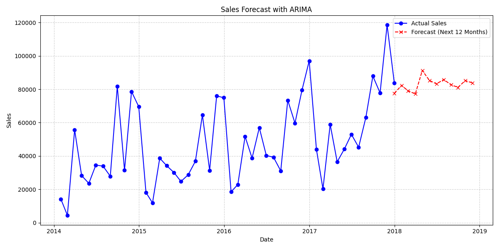
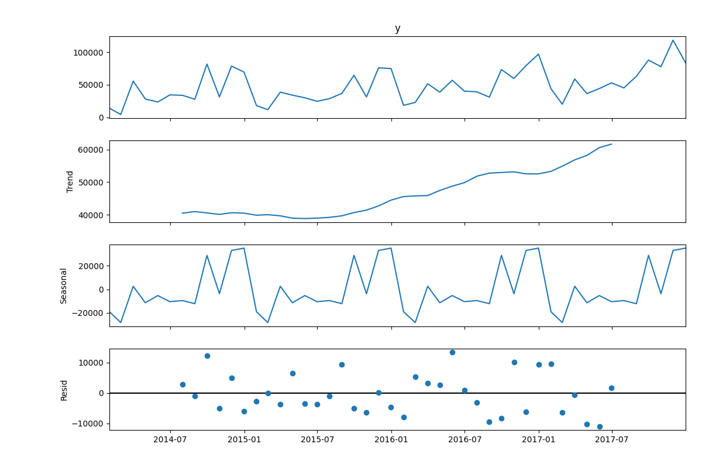

# 🛍️ Retail Sales Analysis

## 📌 Project Overview
This project analyzes retail sales data to uncover key insights such as:
- Top-performing products and sub-categories
- Revenue and profit trends over time
- Regional and customer segment performance
- Impact of discounts on profitability

The goal is to explore sales patterns and create meaningful visualizations to support data-driven decisions (similar to retail analytics at H&M).

---

## 📂 Dataset
- **Source:** Sample Superstore Dataset (Kaggle)
- **Format:** CSV / XLS
- **Typical columns:** Order Date, Ship Date, Segment, Region, Category, Sub-Category, Product Name, Sales, Quantity, Discount, Profit

> If you can’t host the full dataset, include the Kaggle link in this section.

---

## ⚙️ Setup
1) Create a virtual environment (optional but recommended)  
2) Install dependencies:
```bash
pip install pandas matplotlib seaborn openpyxl xlrd

## 📊 Forecasting & Business Insights

### 🔮 Sales Forecast (ARIMA)
We used an ARIMA model to forecast **monthly sales for the next 12 months**.  
The forecast shows:
- A steady upward trend in sales over time.
- Seasonal spikes around **November–December**, indicating holiday season demand.



---

### 📉 Seasonal Decomposition
By decomposing sales into **trend, seasonality, and residuals**, we observed:
- **Trend**: Long-term growth in overall sales.
- **Seasonality**: Recurring spikes in Q4 each year (holiday effect).
- **Residuals**: Short-term fluctuations likely caused by promotions/discounts.



---

### ✅ Business Recommendations
1. **Stock Planning** → Increase inventory before November–December to capture peak demand.  
2. **Discount Strategy** → Optimize discounts in Q4, as sales rise naturally during this period.  
3. **Regional Focus** → Expand marketing in underperforming regions (from EDA insights).  
4. **Profitability Check** → Limit deep discounts on low-margin products (Discount vs Profit analysis).  

