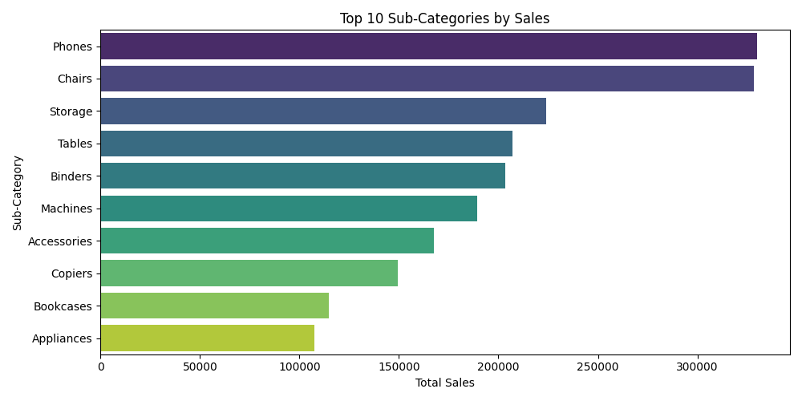
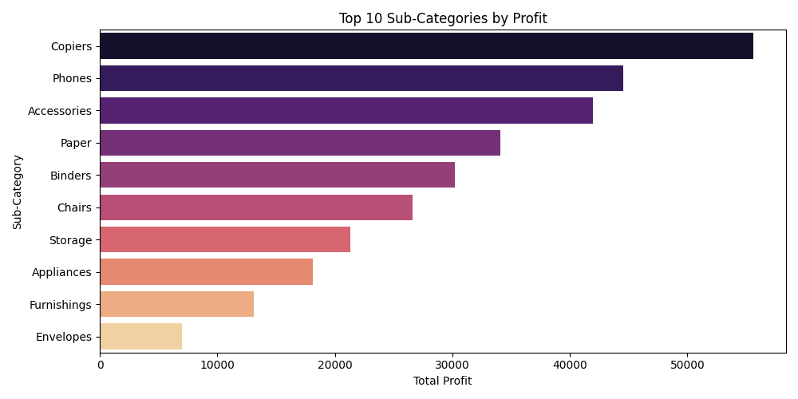
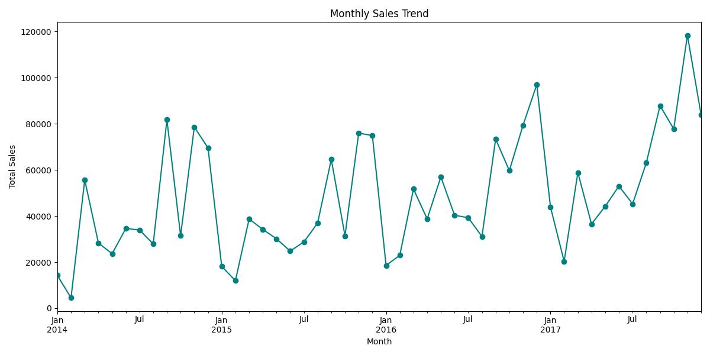
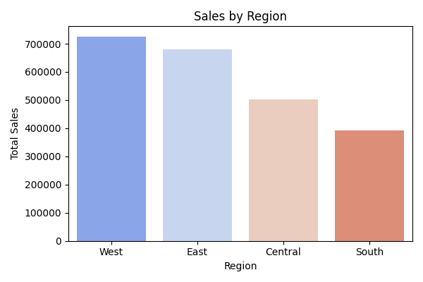
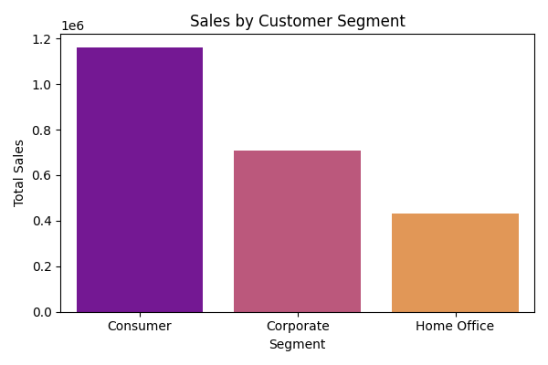
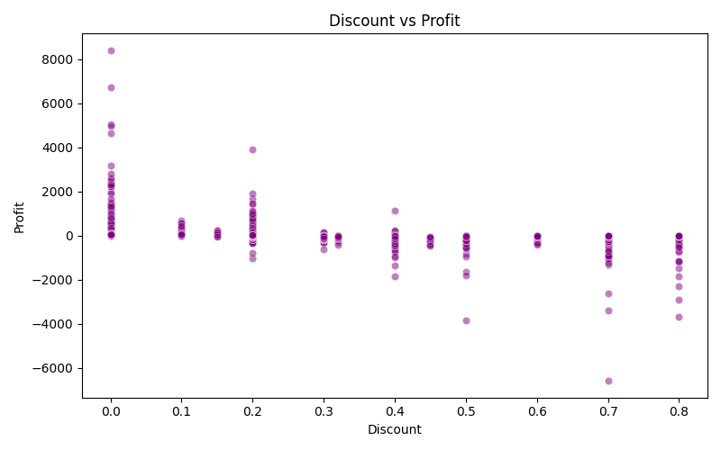
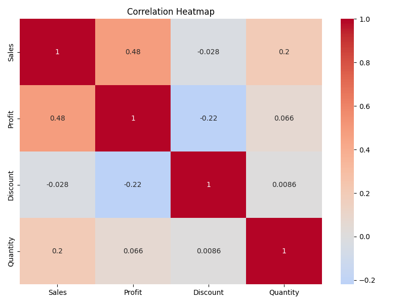

# Retail Sales Analysis - Superstore Dataset

## Overview
This project demonstrates a comprehensive **Retail Sales Analysis** using the Superstore dataset.  
It showcases data cleaning, exploratory data analysis (EDA), and insightful visualizations to understand sales trends, profits, customer segments, and regional performance.  

The analysis is done using **Python (pandas, matplotlib, seaborn)** and can be easily reproduced using the provided `requirements.txt`.

---

## Dataset
The dataset used is the **Sample Superstore dataset**, containing transactional sales data including:  
- Order IDs, Order Dates, Ship Dates  
- Customer information  
- Product details (Category, Sub-Category, Quantity, Sales, Profit, Discount)  

> Dataset can be downloaded from Kaggle: [Sample Superstore](https://www.kaggle.com/datasets/tsarina/sample-superstore)

---

## Key Features of the Analysis
1. Data Cleaning & Preparation  
2. Total Sales & Profit Summary  
3. Top Categories & Products Analysis  
4. Monthly Sales Trend  
5. Regional & Customer Segment Insights  
6. Discount vs Profit Analysis  
7. Correlation Analysis

---

## Visualizations

### Top 10 Sub-Categories by Sales


### Top 10 Sub-Categories by Profit


### Monthly Sales Trend


### Sales by Region


### Sales by Customer Segment


### Discount vs Profit


### Correlation Heatmap


---

## Technologies Used
- Python 3  
- pandas  
- matplotlib  
- seaborn  
- Excel (`.xls`) support via `openpyxl`  

---

## How to Run
1. Clone the repository:  
```bash
git clone https://github.com/Laxmi14S/Retail-Sales-Analysis.git
